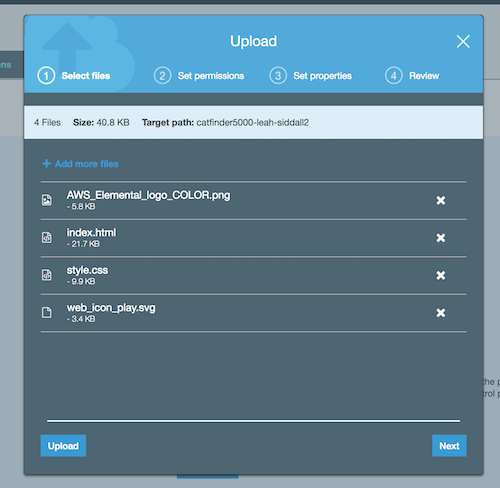
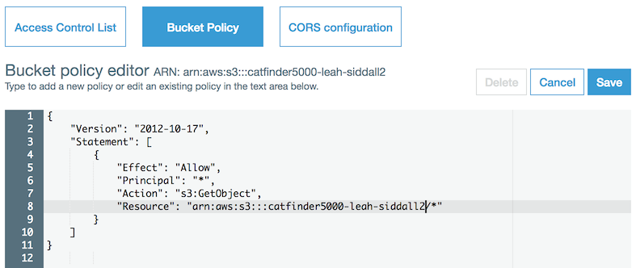

# Module 1: Static Web Hosting with Amazon S3

In this module, you'll configure Amazon Simple Storage Service (S3) to host the static resources for your web application. In subsequent modules, you'll add dynamic functionality to these pages using JavaScript to call .json documents within this Amazon S3 bucket updated with AWS Lambda from Amazon DynamoDB data. You will also place the .jpg files from the livestream indexed by AWS Lambda application in this Amazon S3 bucket. Then you'll use Amazon Rekognition to perform image analysis to detect objects, scenes, and faces; recognize celebrities, and identify inappropriate content. 

## Architecture Overview

The architecture for this module is straightforward. All of your static web content, including HTML, CSS, JavaScript, images and other files, will be stored in Amazon S3. Your end users will then access your site using the public website URL exposed by Amazon S3. You don't need to run any web servers or use other services in order to make your site available.

For the purposes of this module, you'll use the Amazon S3 website endpoint URL that we supply. It takes the form `http://{your-bucket-name}.s3-website.{region}.amazonaws.com`. For most real applications, you'll want to use a custom domain to host your site. If you're interested in using your own domain, follow the instructions for [setting up a static website using a custom domain](http://docs.aws.amazon.com/AmazonS3/latest/dev/website-hosting-custom-domain-walkthrough.html) in the Amazon S3 documentation.

### Browser

We recommend you use the latest version of Chrome to complete this workshop. You may use the latest version of Firefox and Safari, but the video.js player may not operate correctly and you won't be able to play video.

## Implementation Instructions

Each of the following sections provide an implementation overview and detailed, step-by-step instructions. The overview should provide enough context for you to complete the implementation if you're already familiar with the AWS Management Console or you want to explore the services yourself without following a walkthrough.

### Region Selection

This workshop will be deployed in Oregon ( us-west-2 ) Region that supports the following services:

- AWS Lambda
- Amazon S3
- Amazon DynamoDB
- Amazon Rekognition

We will deploy all the resources for this workshop there. Make sure you select your region from the dropdown in the upper right corner of the AWS Management Console before getting started.

### 1. Create an Amazon S3 Bucket

Amazon S3 can be used to host static websites without having to configure or manage any web servers. In this step, you'll create a new Amazon S3 bucket to host all the static assets (e.g. HTML, CSS, JavaScript, and image files) for your web application.

#### High-Level Instructions

Use the console to create an Amazon S3 bucket. Keep in mind that your bucket's name must be globally unique across all AWS Regions and customers. We recommend using a name like `catfinder5000-firstname-lastname`. If you get an error that your bucket name already exists, try adding additional numbers or characters until you find an unused name.

#### Step-by-step instructions

1. In the AWS Management Console, choose **Services**, and then select **S3** under Storage.

1. Choose **+Create Bucket**

1. For **Bucket name**, provide a globally unique name for your bucket, such as `catfinder5000-firstname-lastname`.

1. For **Region**, click **US West Oregon**.

1. Click **Create** in the lower left of the dialog without selecting a bucket to copy settings from.

### 2. Upload Content

Upload the website assets for this module to your Amazon S3 bucket. You can use the AWS Management Console (requires Google Chrome browser) to complete this step.

#### Manual File Download step-by-step instructions

1. Download the file here: <https://s3-us-west-2.amazonaws.com/rodeolabz-us-west-2/instantvideohighlights/catfinder5000-website.zip>

1. Unzip the `catfinder5000-website.zip` to a temporary location ( See [Howto: Unzip](https://answers.stanford.edu/solution/how-do-i-zip-and-unzip-files-and-folders-do-i-need-winzip-or-stuffit) for help )

    **Note:** On Windows OS you may want to put the .zip file in a new temporary directory before extracting

1. In the S3 console, select the name of the bucket you created in section 1.

1. Click **UPLOAD**  and either select the files in the `catfinder5000-website` folder from the "Add files" or drag and drop the individual files ( not the folder ) extracted from the zip file into the browser. 

    

1. Click **Upload**

### 3. Add a Bucket Policy to Allow Public Reads

You can define who can access the content in your Amazon S3 buckets using a bucket policy. Bucket policies are JSON documents that specify what principals are allowed to execute various actions against the objects in your bucket.

#### High-Level Instructions - Bucket Policy

You will need to add a bucket policy to your new Amazon S3 bucket to let anonymous users view your site. By default, your bucket will only be accessible by authenticated users who have access to your AWS account.

See [this example](http://docs.aws.amazon.com/AmazonS3/latest/dev/example-bucket-policies.html#example-bucket-policies-use-case-2) of a policy that will grant read-only access to anonymous users. This example policy allows anyone on the Internet to view your content. The easiest way to update a bucket policy is to use the console. Select the bucket, choose the Permissions tab, and then select Bucket Policy.

#### Step-by-step instructions - Bucket Policy

1. In the Amazon S3 console, select the name of the bucket you created in section 1.

1. Choose the **Permissions** tab, then choose **Bucket Policy**.

1. Enter the following policy document into the bucket policy editor, replacing `[YOUR_BUCKET_NAME]` with the name of the bucket you created in section 1:

    ```json
    {
        "Version": "2012-10-17",
        "Statement": [
            {
                "Effect": "Allow",
                "Principal": "*",
                "Action": "s3:GetObject",
                "Resource": "arn:aws:s3:::[YOUR_BUCKET_NAME]/*"
            }
        ]
    }
    ```

    

    **Note:** The bucket name is listed in the ARN above the Bucket Policy Editor

    **Note:** Confirm `/*` is after your bucket name in the "Resource"

1. Click **Save** to apply the new policy.

    **Note:** you will get a warning stating "This bucket has public access" is expected in this lab.

### 4. Enable Website Hosting

#### High-Level Instructions - Website Hosting

Using the console, enable static website hosting. You can do this on the Properties tab after you've selected the bucket. Set `index.html` as the index document, and leave the error document blank. See the documentation on [configuring a bucket for static website hosting](https://docs.aws.amazon.com/AmazonS3/latest/dev/HowDoIWebsiteConfiguration.html) for more details.

#### Step-by-step instructions - Website Hosting

1. From the bucket detail page in the Amazon S3 console, choose the **Properties** tab.

1. Choose the **Static website hosting** card.

1. Select **Use this bucket to host a website** and enter `index.html` for the Index document. Leave the other fields blank. 

    

1. Note the **Endpoint** URL at the top of the dialog before choosing **Save**. You will use this URL throughout the rest of the workshop to view your web application. From here on, this URL will be referred to as your website's base URL.

1. Click **Save** to save your changes.

## Implementation Validation  - Website Hosting

After completing these steps, you should be able to access your static website by visiting the website endpoint URL for your Amazon S3 bucket.

Visit your website's base URL (this is the URL you noted in section 4) in the browser of your choice. You should see the page displayed. If you need to look up the base URL, visit the Amazon S3 console, select your bucket, and then click the **Static Web Hosting** card on the **Properties** tab.

If the page renders correctly, you can move on to the next module, [Module 2: DynamoDB](../2_DynamoDB/README.md).
